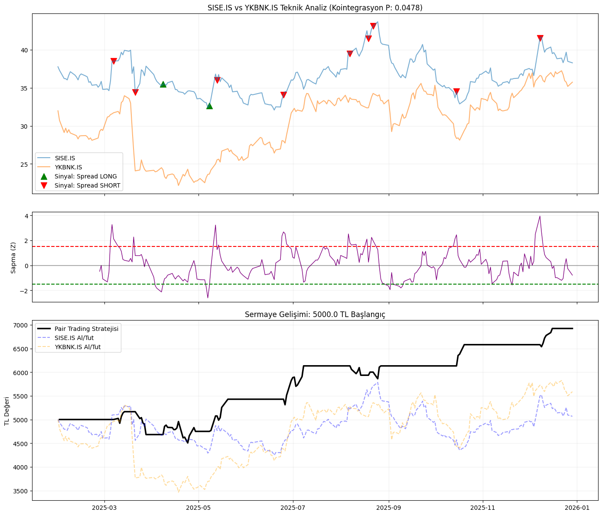
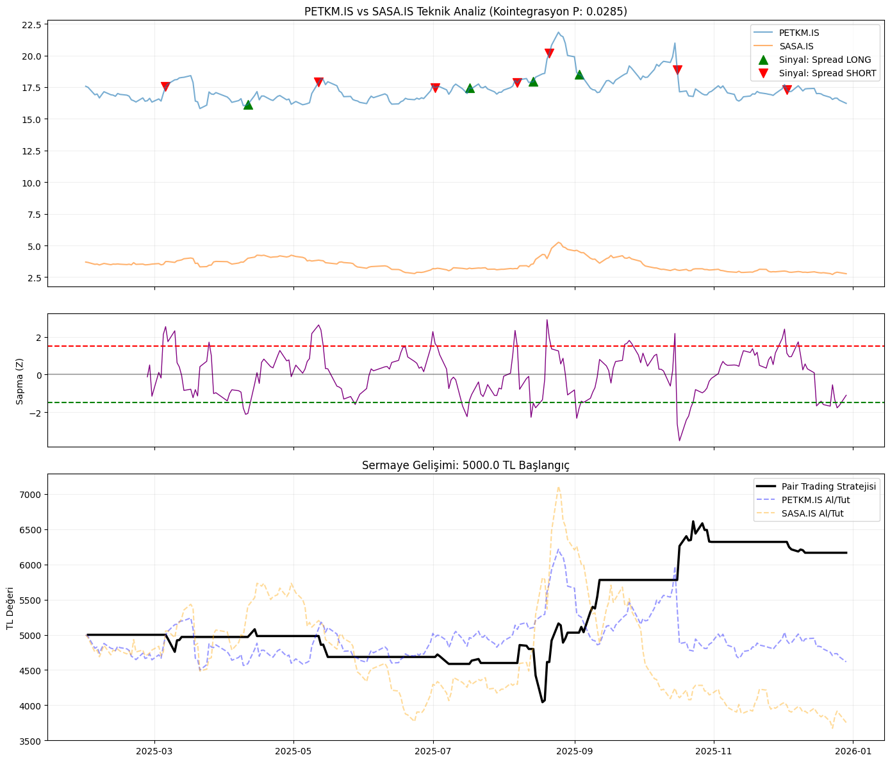

# BIST-30 Cointegration-Based Pair Trading Strategy

This project applies a **statistical arbitrage (pair trading)** strategy on **BIST-30 stocks** using **cointegration analysis** and mean-reversion principles.

The goal is to identify statistically related stock pairs and evaluate how a systematic pair trading strategy would have performed during **2025–2026** with an initial capital of **5,000 TL**.

---

## Project Objectives
- Select cointegrated stock pairs in BIST-30 (p-value < 0.05)
- Apply a pair trading strategy
- Backtest strategy performance between 2025–2026
- Compare strategy returns with buy-and-hold

---

## Data
- **Source:** Yahoo Finance
- **Stocks:** BIST-30 
- **Period:** 2025-01-01 to 2026-01-01
- **Price Type:** Close prices
- **Transformation:** Log prices

---

### 1️⃣ Cointegration Analysis
To identify statistically related stock pairs, **Engle–Granger cointegration analysis** was applied to all possible **BIST-30 stock combinations**.

**Libraries Used:**
- `yfinance` – downloading historical price data  
- `pandas`, `numpy` – data manipulation and numerical operations  
- `statsmodels.tsa.stattools.coint` – Engle–Granger cointegration test  

**Methodology:**
- Daily **closing prices** were collected from Yahoo Finance.
- Price series were converted to **logarithmic form** to stabilize variance and improve statistical robustness.
- For each stock pair `(A, B)`, the Engle–Granger test evaluates whether a **linear combination of their log prices is stationary**, indicating a long-term equilibrium relationship.
- Pairs with `p-value < 0.05` selected for trading

---

### 2️⃣ Pair Trading Strategy

For each cointegrated stock pair, a **mean-reversion based pair trading strategy** was implemented using a **rolling Ordinary Least Squares (OLS) regression**.

**Libraries Used:**
- `statsmodels.api` – OLS regression modeling  
- `pandas`, `numpy` – rolling window calculations and vectorized operations  

**Hedge Ratio Estimation:**
- A **20-day rolling window** OLS regression was applied to log-transformed prices.

---

## 3. Signal Generation (Z-Score)

To normalize the spread and identify extreme deviations, we calculate the **Z-Score** using a rolling window:

- Trading rules:
  - **Z > +2** → Short the spread  
  - **Z < −2** → Long the spread  
  - **|Z| < 0.5** → Exit position  

This approach exploits temporary deviations from equilibrium while maintaining market-neutral exposure.

---

## Backtest Performance (2025 Summary)

Initial Capital: **5,000.00 TRY**

| TRADING PAIR | COINT (P) | VOLATILITY | YEAR-END (TRY) | STATUS |
| --- | --- | --- | --- | --- |
| **BIMAS.IS-PGSUS.IS** | 0.0172 | 0.0219 | **6,969.23 TRY** | ✅ SUCCESSFUL |
| **SISE.IS-YKBNK.IS** | 0.0478 | 0.0241 | **6,922.55 TRY** | ✅ SUCCESSFUL |
| **PETKM.IS-SASA.IS** | 0.0285 | 0.0273 | **6,165.54 TRY** | ✅ SUCCESSFUL |
| **PETKM.IS-SAHOL.IS** | 0.0384 | 0.0209 | **5,826.43 TRY** | ✅ SUCCESSFUL |
| **PETKM.IS-TCELL.IS** | 0.0445 | 0.0220 | 5,791.23 TRY | ✅ SUCCESSFUL |
| **BIMAS.IS-EKGYO.IS** | 0.0473 | 0.0273 | 5,790.92 TRY | ✅ SUCCESSFUL |
| **BIMAS.IS-TOASO.IS** | 0.0279 | 0.0273 | 5,693.83 TRY | ✅ SUCCESSFUL |
| **SISE.IS-VAKBN.IS** | 0.0120 | 0.0241 | 5,401.76 TRY | ✅ SUCCESSFUL |
| **PETKM.IS-TAVHL.IS** | 0.0351 | 0.0233 | 5,321.98 TRY | ✅ SUCCESSFUL |
| **BIMAS.IS-YKBNK.IS** | 0.0229 | 0.0258 | 5,162.05 TRY | ✅ SUCCESSFUL |
| **AKBNK.IS-VAKBN.IS** | 0.0247 | 0.0189 | 5,073.88 TRY | ✅ SUCCESSFUL |
| **AKBNK.IS-KCHOL.IS** | 0.0271 | 0.0214 | 4,968.52 TRY | ✅ SUCCESSFUL |
| **PETKM.IS-SISE.IS** | 0.0673 | 0.0185 | 4,780.36 TRY | ⚠️ RISKY |
| **PETKM.IS-TOASO.IS** | 0.0082 | 0.0257 | 4,724.03 TRY | ✅ SUCCESSFUL |
| **PETKM.IS-TUPRS.IS** | 0.0077 | 0.0212 | 4,233.50 TRY | ✅ SUCCESSFUL |

---

## Graphics

Visualizations of price action, Z-Score thresholds, and equity growth are stored in the `results/` folder.

### Top Performance Pairs

1. BIMAS - PGSUS Analysis (Balance: 6,969 TRY)

2. SISE - YKBNK Analysis (Balance: 6,922 TRY)

3. PETKM - SASA Analysis (Balance: 6,165 TRY)

All List

3. **PETKM - VAKBN:** `results/PETKM.IS_VAKBN.IS_analysis.png`
4. **PETKM - THYAO:** `results/PETKM.IS_THYAO.IS_analysis.png`
5. **BIMAS - YKBNK:** `results/BIMAS.IS_YKBNK.IS_analysis.png`
6. **PETKM - YKBNK:** `results/PETKM.IS_YKBNK.IS_analysis.png`
7. **AKBNK - VAKBN:** `results/AKBNK.IS_VAKBN.IS_analysis.png`
8. **AKBNK - KCHOL:** `results/AKBNK.IS_KCHOL.IS_analysis.png`
9. **PETKM - PGSUS:** `results/PETKM.IS_PGSUS.IS_analysis.png`
10. **PETKM - SASA:** `results/PETKM.IS_SASA.IS_analysis.png`
11. **BIMAS - TOASO:** `results/BIMAS.IS_TOASO.IS_analysis.png`
12. **PETKM - TAVHL:** `results/PETKM.IS_TAVHL.IS_analysis.png`
13. **PETKM - SAHOL:** `results/PETKM.IS_SAHOL.IS_analysis.png`
14. **TCELL - YKBNK:** `results/TCELL.IS_YKBNK.IS_analysis.png`
15. **PETKM - TCELL:** `results/PETKM.IS_TCELL.IS_analysis.png`
16. **BIMAS - TUPRS:** `results/BIMAS.IS_TUPRS.IS_analysis.png`
17. **HEKTS - PETKM:** `results/HEKTS.IS_PETKM.IS_analysis.png`
18. **PETKM - SISE:** `results/PETKM.IS_SISE.IS_analysis.png`
19. **BIMAS - EKGYO:** `results/BIMAS.IS_EKGYO.IS_analysis.png`

## Tech Stack
- Python
- yfinance
- pandas
- numpy
- statsmodels
- matplotlib

---

## Disclaimer
This project is for **educational and research purposes only**.  
It does **not** constitute investment advice.