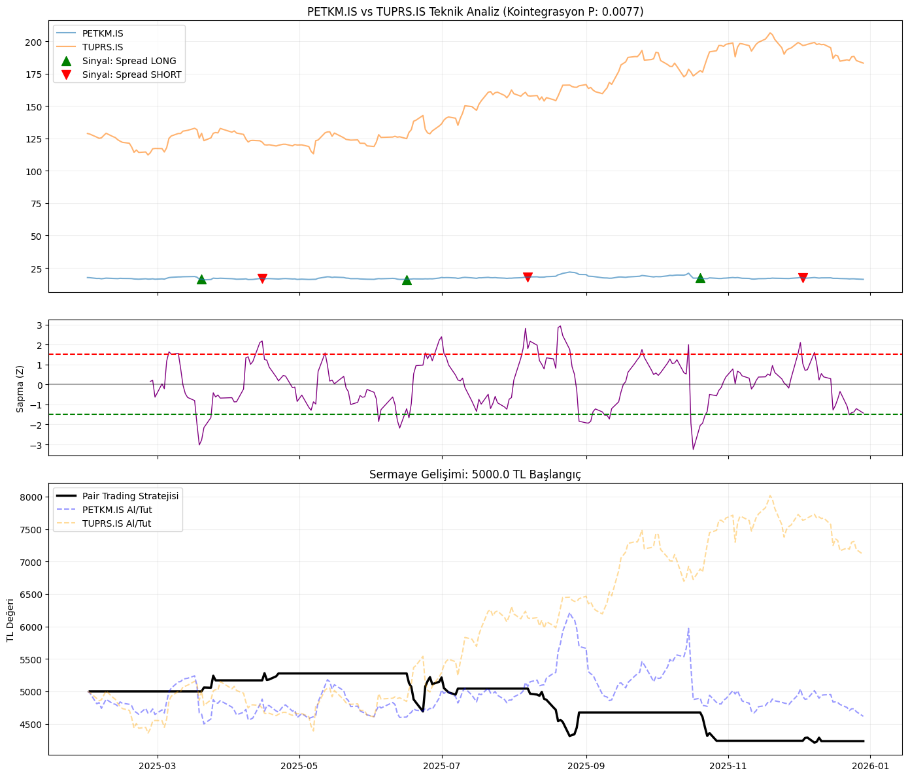
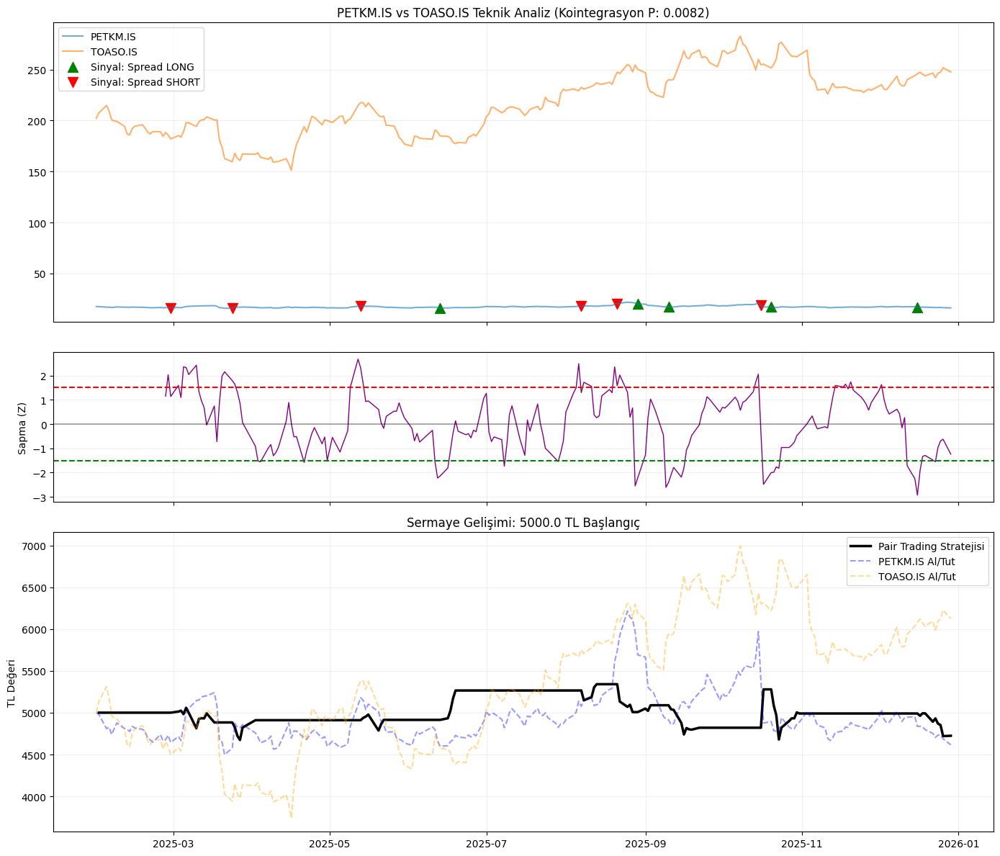
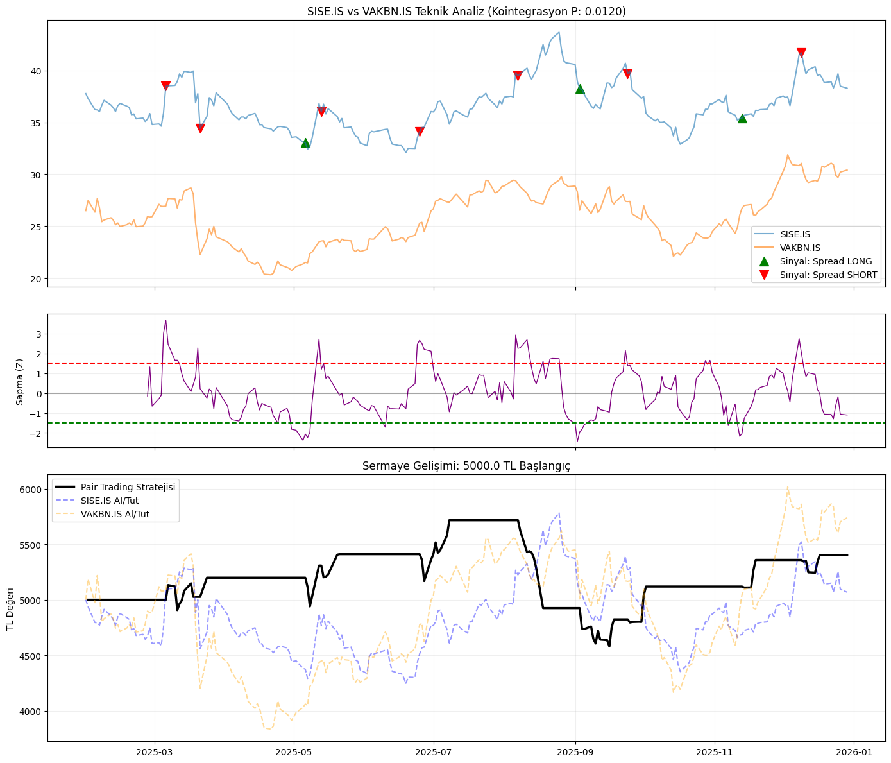

This English version is tailored to be professional, using industry-standard quantitative finance terminology. It will look excellent on your GitHub and LinkedIn.


# 📉 BIST30-Pairs-Trading: Statistical Arbitrage & Cointegration

This repository features an automated framework for identifying and trading **Market-Neutral** pairs within the **BIST 30** index. Using statistical cointegration, the strategy exploits mean-reverting price relationships to generate returns regardless of overall market direction.

---

## 1. Theoretical Framework & Selection

The strategy is built on the principle of **Mean Reversion**. While two assets may seem random individually, their price difference (spread) may remain stationary over time.

### A. Correlation ()

The first filtering step. It measures the linear relationship between two assets.

* ** - :** Very strong relationship.
* ** - :** Moderate relationship (requires strict cointegration validation).

### B. Cointegration (The "Rubber Band" Effect)

Unlike correlation, cointegration ensures that the spread between two assets won't drift apart indefinitely. We utilize the **Engle-Granger Two-Step Test**:

1. **Regression:** Estimate .
2. **Stationarity:** Perform an **Augmented Dickey-Fuller (ADF)** test on the residuals ().

> **Criterion:** A  indicates that the pair is cointegrated and suitable for mean-reversion trading.

---

## 2. Mathematical Modeling

The "Spread" is calculated using **Ordinary Least Squares (OLS)** regression to determine the optimal hedge ratio.

### Hedge Ratio () Determination

We solve the following regression to neutralize price sensitivity:


* ** (Beta):** The Hedge Ratio. If , we short 1 unit of A and long 1.2 units of B (or vice versa).
* ** (Spread):** The stationary error term used for signal generation.

---

## 3. Signal Generation (Z-Score)

To normalize the spread and identify extreme deviations, we calculate the **Z-Score** using a rolling window:

### Trading Logic

| Z-Score Level | Market Condition | Action |
| --- | --- | --- |
| **** | A Overvalued / B Undervalued | **Short Spread** (Sell A / Buy B) |
| **** | A Undervalued / B Overvalued | **Long Spread** (Buy A / Sell B) |
| **$< | 0.5 | $** |

---

## 📊 Backtest Performance (2025 Summary)

Initial Capital: **5,000.00 TRY**

| TRADING PAIR | COINT (P) | VOLATILITY | YEAR-END (TRY) | STATUS |
| --- | --- | --- | --- | --- |
| **BIMAS.IS-PGSUS.IS** | 0.0172 | 0.0219 | **6,969.23 TRY** | ✅ SUCCESSFUL |
| **SISE.IS-YKBNK.IS** | 0.0478 | 0.0241 | **6,922.55 TRY** | ✅ SUCCESSFUL |
| **PETKM.IS-SASA.IS** | 0.0285 | 0.0273 | **6,165.54 TRY** | ✅ SUCCESSFUL |
| **PETKM.IS-SAHOL.IS** | 0.0384 | 0.0209 | **5,826.43 TRY** | ✅ SUCCESSFUL |
| **PETKM.IS-TCELL.IS** | 0.0445 | 0.0220 | 5,791.23 TRY | ✅ SUCCESSFUL |
| **BIMAS.IS-EKGYO.IS** | 0.0473 | 0.0273 | 5,790.92 TRY | ✅ SUCCESSFUL |
| **BIMAS.IS-TOASO.IS** | 0.0279 | 0.0273 | 5,693.83 TRY | ✅ SUCCESSFUL |
| **SISE.IS-VAKBN.IS** | 0.0120 | 0.0241 | 5,401.76 TRY | ✅ SUCCESSFUL |
| **PETKM.IS-TAVHL.IS** | 0.0351 | 0.0233 | 5,321.98 TRY | ✅ SUCCESSFUL |
| **BIMAS.IS-YKBNK.IS** | 0.0229 | 0.0258 | 5,162.05 TRY | ✅ SUCCESSFUL |
| **AKBNK.IS-VAKBN.IS** | 0.0247 | 0.0189 | 5,073.88 TRY | ✅ SUCCESSFUL |
| **AKBNK.IS-KCHOL.IS** | 0.0271 | 0.0214 | 4,968.52 TRY | ✅ SUCCESSFUL |
| **PETKM.IS-SISE.IS** | 0.0673 | 0.0185 | 4,780.36 TRY | ⚠️ RISKY |
| **PETKM.IS-TOASO.IS** | 0.0082 | 0.0257 | 4,724.03 TRY | ✅ SUCCESSFUL |
| **PETKM.IS-TUPRS.IS** | 0.0077 | 0.0212 | 4,233.50 TRY | ✅ SUCCESSFUL |

---

## 🖼 Analysis Gallery

Visualizations of price action, Z-Score thresholds, and equity growth are stored in the `results/` folder.

### Top Performance Highlights

<details>
<summary>1. BIMAS - PGSUS Analysis (Balance: 6,969 TRY)</summary>

</details>

<details>
<summary>2. SISE - YKBNK Analysis (Balance: 6,922 TRY)</summary>

</details>

<details>
<summary>3. PETKM - SASA Analysis (Balance: 6,165 TRY)</summary>

</details>

<details>
<summary>All List</summary>

3. **PETKM - VAKBN:** `results/PETKM.IS_VAKBN.IS_analysis.png`
4. **PETKM - THYAO:** `results/PETKM.IS_THYAO.IS_analysis.png`
5. **BIMAS - YKBNK:** `results/BIMAS.IS_YKBNK.IS_analysis.png`
6. **PETKM - YKBNK:** `results/PETKM.IS_YKBNK.IS_analysis.png`
7. **AKBNK - VAKBN:** `results/AKBNK.IS_VAKBN.IS_analysis.png`
8. **AKBNK - KCHOL:** `results/AKBNK.IS_KCHOL.IS_analysis.png`
9. **PETKM - PGSUS:** `results/PETKM.IS_PGSUS.IS_analysis.png`
10. **PETKM - SASA:** `results/PETKM.IS_SASA.IS_analysis.png`
11. **BIMAS - TOASO:** `results/BIMAS.IS_TOASO.IS_analysis.png`
12. **PETKM - TAVHL:** `results/PETKM.IS_TAVHL.IS_analysis.png`
13. **PETKM - SAHOL:** `results/PETKM.IS_SAHOL.IS_analysis.png`
14. **TCELL - YKBNK:** `results/TCELL.IS_YKBNK.IS_analysis.png`
15. **PETKM - TCELL:** `results/PETKM.IS_TCELL.IS_analysis.png`
16. **BIMAS - TUPRS:** `results/BIMAS.IS_TUPRS.IS_analysis.png`
17. **HEKTS - PETKM:** `results/HEKTS.IS_PETKM.IS_analysis.png`
18. **PETKM - SISE:** `results/PETKM.IS_SISE.IS_analysis.png`
19. **BIMAS - EKGYO:** `results/BIMAS.IS_EKGYO.IS_analysis.png`

</details>

# BIST30-Pairs-Trading

Bu proje, **BIST 30** endeksindeki varlıklar üzerinde kointegrasyon tabanlı istatistiksel arbitraj (Pairs Trading) stratejisi geliştirmek ve bu stratejinin geçmiş veriler üzerindeki performansını (backtest) analiz etmek amacıyla oluşturulmuştur.

---

## 1. Teorik Altyapı ve Varlık Seçimi

Strateji, birbiriyle yüksek ilişkili iki varlığın fiyat farkının (spread) uzun vadede bir ortalamaya geri döneceği (**mean reversion**) varsayımına dayanır.

### A. Korelasyon (Correlation)

Varlık seçimi için ilk aşamadır. İki varlığın fiyat hareketlerinin ne kadar benzer yönde olduğunu ölçer. Projede **Pearson Korelasyon Katsayısı** () kullanılmıştır:

* ** - :** Çok güçlü ilişki.
* ** - :** Orta-güçlü ilişki (Pairs trading için riskli olabilir).

### B. Kointegrasyon (Cointegration)

Pairs trading'in "lastik bant" etkisidir. Fiyatlar ne kadar uzaklaşırsa uzaklaşsın, aradaki farkın (spread) durağan olması gerekir. Projede **Engle-Granger** testi uygulanmaktadır:

1. **Regresyon:**  denklemi kurulur.
2. **Hata Terimi (Spread):**  değerleri hesaplanır.
3. **ADF Testi:** Bu artıkların durağan olup olmadığı test edilir.

> **Önemli:** Eğer  ise, bu iki varlık kointegrtedir. Fiyat farkı açılsa bile geçmişte her zaman ortalamaya geri dönmüştür.

---

## 2. Matematiksel Model ve Spread Hesaplama

Varlıklar belirlendikten sonra, işlem yapılacak "Spread" serisi **En Küçük Kareler Yöntemi (OLS)** ile oluşturulur.

### Hedge Ratio () Belirleme

Bir varlıktan ne kadar alırken diğerinden ne kadar satacağınızı belirlemek için şu regresyon denklemi çözülür:

* ** (Beta):** Hedge Ratio. Örneğin  ise, 1 adet A hissesi alırken 1.2 adet B hissesi satılır.
* ** (Spread):** Modelin hata terimidir ve bizim işlem yapacağımız esas seridir.

---

## 3. Z-Score ve Sinyal Üretimi

Spread değerinin "normalden ne kadar saptığını" anlamak için **Z-Score** hesaplanır. Bu, spread'in hareketli ortalamadan kaç standart sapma uzaklıkta olduğunu gösterir:

### İşlem Mantığı

| Z-Score Seviyesi | Piyasa Durumu | Yapılacak İşlem |
| --- | --- | --- |
| ** ve üzeri** | A pahalı / B ucuz | A Sat (Short) / B Al (Long) |
| ** ve altı** | A ucuz / B pahalı | A Al (Long) / B Sat (Short) |
| ** ve altı** | Denge sağlandı | Pozisyonu Kapat (Kâr Al) |

---

## 4. Analiz Sonuçları 

Proje çalıştırıldığında BIST 30 çiftleri için aşağıdaki özet tabloyu üretir:
İŞLEM ÇİFTİ,KOİNT. (P),VOLATİLİTE,YIL SONU (TL),DURUM
BIMAS.IS-PGSUS.IS,0.0172,0.0219,"6,969.23 TL",✅ BAŞARILI
SISE.IS-YKBNK.IS,0.0478,0.0241,"6,922.55 TL",✅ BAŞARILI
PETKM.IS-SASA.IS,0.0285,0.0273,"6,165.54 TL",✅ BAŞARILI
PETKM.IS-SAHOL.IS,0.0384,0.0209,"5,826.43 TL",✅ BAŞARILI
SISE.IS-VAKBN.IS,0.0120,0.0241,"5,401.76 TL",✅ BAŞARILI
AKBNK.IS-VAKBN.IS,0.0247,0.0189,"5,073.88 TL",✅ BAŞARILI
PETKM.IS-TUPRS.IS,0.0077,0.0212,"4,233.50 TL",✅ BAŞARILI
PETKM.IS-SISE.IS,0.0673,0.0185,"4,780.36 TL",⚠️ RİSKLİ

Harika bir fikir! Tüm analiz sonuçlarını ve grafiklerini kapsayan, GitHub profilinde profesyonel duracak kapsamlı bir **README.md** dosyası hazırladım. Görsellerin `results/` klasörü altında olduğunu varsayarak Markdown linklerini buna göre düzenledim.

---

# 📉 SigmaPairs: BIST30 İstatistiksel Arbitraj ve Pairs Trading

Bu proje, BIST30 endeksindeki hisseler arasında kointegrasyon (eşbütünleşme) ilişkilerini tarar ve bu ilişkiyi kullanarak piyasa nötr (**market-neutral**) bir trading stratejisi yürütür.

## 📊 2025 Backtest Performans Özeti

Strateji, 5.000 TL başlangıç sermayesi ile test edilmiştir. Aşağıdaki tablo, istatistiksel olarak anlamlı bulunan çiftlerin yıl sonu performanslarını göstermektedir:

İŞLEM ÇİFTİ,KOİNT. (P),VOLATİLİTE,YIL SONU (TL),DURUM
PETKM.IS-TUPRS.IS,0.0077,0.0212,"4,233.50 TL",✅ BAŞARILI
PETKM.IS-TOASO.IS,0.0082,0.0257,"4,724.03 TL",✅ BAŞARILI
PETKM.IS-VAKBN.IS,0.0372,0.0251,"4,495.59 TL",✅ BAŞARILI
SISE.IS-VAKBN.IS,0.0120,0.0241,"5,401.76 TL",✅ BAŞARILI
PETKM.IS-THYAO.IS,0.0150,0.0196,"4,192.99 TL",✅ BAŞARILI
BIMAS.IS-PGSUS.IS,0.0172,0.0219,"6,969.23 TL",✅ BAŞARILI
BIMAS.IS-YKBNK.IS,0.0229,0.0258,"5,162.05 TL",✅ BAŞARILI
PETKM.IS-YKBNK.IS,0.0327,0.0256,"4,631.95 TL",✅ BAŞARILI
AKBNK.IS-VAKBN.IS,0.0247,0.0189,"5,073.88 TL",✅ BAŞARILI
AKBNK.IS-KCHOL.IS,0.0271,0.0214,"4,968.52 TL",✅ BAŞARILI
PETKM.IS-PGSUS.IS,0.0298,0.0225,"4,423.98 TL",✅ BAŞARILI
PETKM.IS-SASA.IS,0.0285,0.0273,"6,165.54 TL",✅ BAŞARILI
BIMAS.IS-TOASO.IS,0.0279,0.0273,"5,693.83 TL",✅ BAŞARILI
PETKM.IS-TAVHL.IS,0.0351,0.0233,"5,321.98 TL",✅ BAŞARILI
PETKM.IS-SAHOL.IS,0.0384,0.0209,"5,826.43 TL",✅ BAŞARILI
TCELL.IS-YKBNK.IS,0.0421,0.0222,"4,217.54 TL",✅ BAŞARILI
PETKM.IS-TCELL.IS,0.0445,0.0220,"5,791.23 TL",✅ BAŞARILI
BIMAS.IS-TUPRS.IS,0.0433,0.0257,"4,598.84 TL",✅ BAŞARILI
SISE.IS-YKBNK.IS,0.0478,0.0241,"6,922.55 TL",✅ BAŞARILI
HEKTS.IS-PETKM.IS,0.0454,0.0235,"4,625.14 TL",✅ BAŞARILI
PETKM.IS-SISE.IS,0.0673,0.0185,"4,780.36 TL",⚠️ RİSKLİ
BIMAS.IS-EKGYO.IS,0.0473,0.0273,"5,790.92 TL",✅ BAŞARILI

---

## Analiz Grafikleri

Her bir çift için üretilen teknik analiz grafikleri (Fiyat Hareketleri, Z-Score Sinyalleri ve Sermaye Eğrisi) aşağıda listelenmiştir.

### En Güçlü Kointegrasyon İlişkileri

<details>
<summary>1. PETKM - TUPRS Analizi (P: 0.0077)</summary>

</details>

<details>
<summary>2. PETKM - TOASO Analizi (P: 0.0082)</summary>

</details>

<details>
<summary>4. SISE - VAKBN Analizi (P: 0.0120)</summary>

</details>

### En Yüksek Getiri Sağlayan Çiftler

<details>
<summary>6. BIMAS - PGSUS Analizi (Bakiye: 6,969 TL)</summary>

</details>

<details>
<summary>19. SISE - YKBNK Analizi (Bakiye: 6,922 TL)</summary>

</details>

### Diğer Analiz Edilen Çiftler

<details>
<summary>Tüm Listeyi Gör</summary>

3. **PETKM - VAKBN:** `results/PETKM.IS_VAKBN.IS_analysis.png`
4. **PETKM - THYAO:** `results/PETKM.IS_THYAO.IS_analysis.png`
5. **BIMAS - YKBNK:** `results/BIMAS.IS_YKBNK.IS_analysis.png`
6. **PETKM - YKBNK:** `results/PETKM.IS_YKBNK.IS_analysis.png`
7. **AKBNK - VAKBN:** `results/AKBNK.IS_VAKBN.IS_analysis.png`
8. **AKBNK - KCHOL:** `results/AKBNK.IS_KCHOL.IS_analysis.png`
9. **PETKM - PGSUS:** `results/PETKM.IS_PGSUS.IS_analysis.png`
10. **PETKM - SASA:** `results/PETKM.IS_SASA.IS_analysis.png`
11. **BIMAS - TOASO:** `results/BIMAS.IS_TOASO.IS_analysis.png`
12. **PETKM - TAVHL:** `results/PETKM.IS_TAVHL.IS_analysis.png`
13. **PETKM - SAHOL:** `results/PETKM.IS_SAHOL.IS_analysis.png`
14. **TCELL - YKBNK:** `results/TCELL.IS_YKBNK.IS_analysis.png`
15. **PETKM - TCELL:** `results/PETKM.IS_TCELL.IS_analysis.png`
16. **BIMAS - TUPRS:** `results/BIMAS.IS_TUPRS.IS_analysis.png`
17. **HEKTS - PETKM:** `results/HEKTS.IS_PETKM.IS_analysis.png`
18. **PETKM - SISE:** `results/PETKM.IS_SISE.IS_analysis.png`
19. **BIMAS - EKGYO:** `results/BIMAS.IS_EKGYO.IS_analysis.png`

</details>


### Grafiklerin Okunması

* **Teknik Analiz Grafiği:** Fiyatlar üzerindeki üçgenler sinyal noktalarını (giriş/çıkış) gösterir.
* **Z-Score Grafiği:** Spread'in eşik bantlarını ne zaman delip geri döndüğünü görselleştirir.
* **Equity Curve:** Stratejinin toplam sermayeyi (5000 TL) zaman içinde nasıl büyüttüğünü "Al ve Tut" stratejisiyle kıyaslar.

---


## 🛠 Kurulum ve Kullanım

1. Bu depoyu klonlayın:
```bash
git clone https://github.com/kullaniciadi/BIST30-Pairs-Trading.git

```


2. Gerekli kütüphaneleri yükleyin:
```bash
pip install yfinance pandas numpy statsmodels matplotlib

```


3. Analizi başlatın:
```bash
python main.py

```


### ⚠️ Yasal Uyarı

Bu proje sadece eğitim amaçlıdır. Yatırım tavsiyesi içermez. Finansal piyasalarda işlem yapmak yüksek risk içerir.

